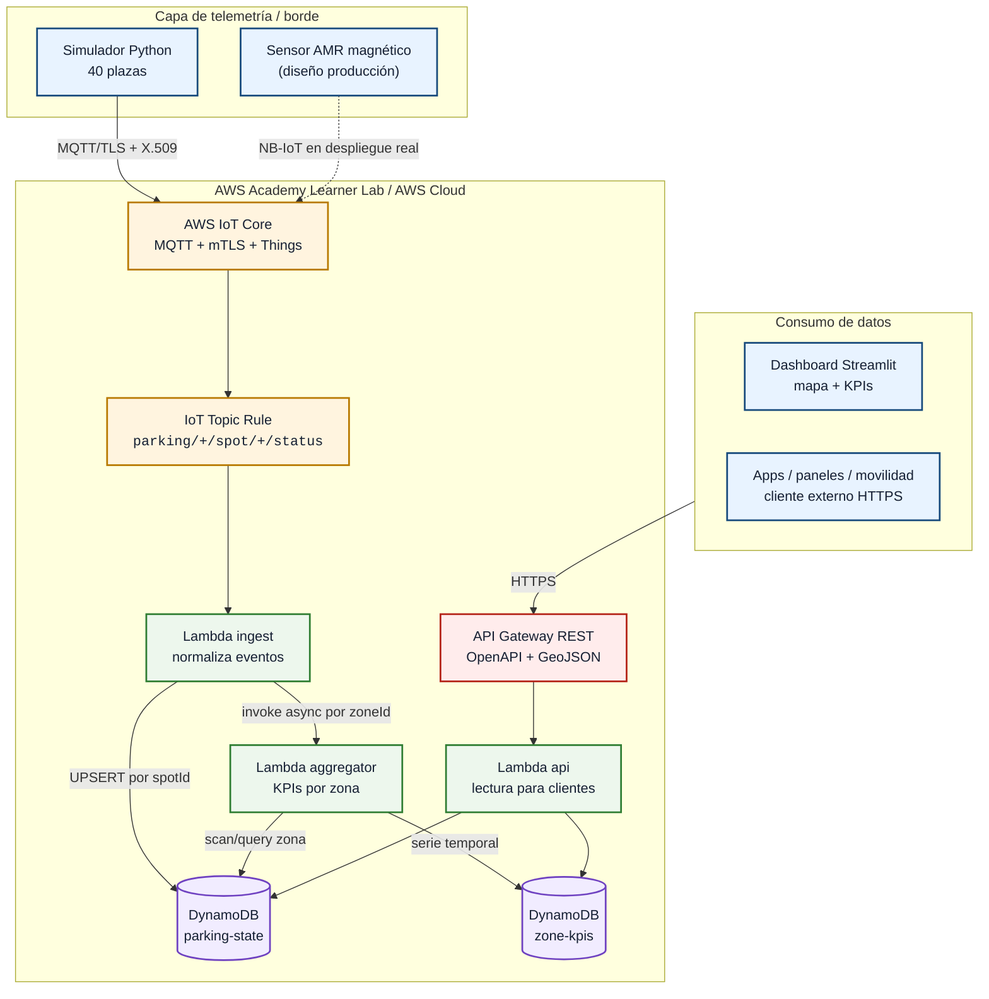
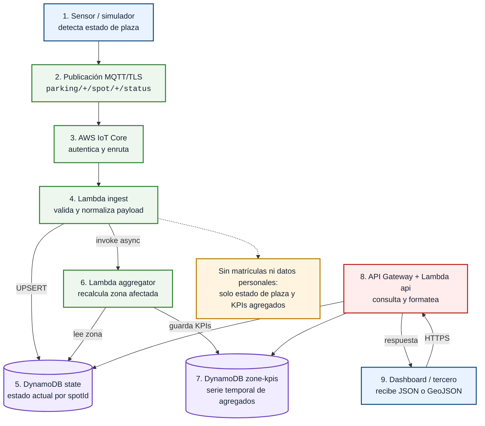
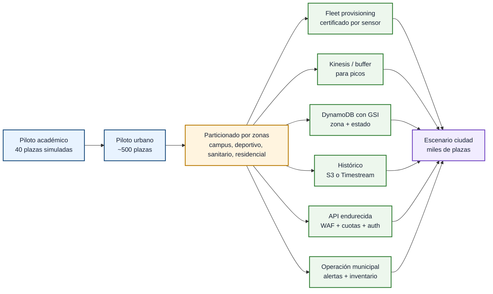

# 0. Resumen ejecutivo

Este proyecto plantea una solución IoT de **aparcamiento inteligente** para una zona piloto del entorno universitario de Albacete. El caso de uso parte de una licitación ficticia del Ayuntamiento de Albacete y de una respuesta técnica de TECO S.L. El objetivo no es solo contar cuántas plazas están libres, sino diseñar una arquitectura completa capaz de recoger datos desde sensores, procesarlos, mantener el estado actualizado de cada plaza y exponer esa información a aplicaciones externas, paneles urbanos o futuros sistemas de movilidad conectada.

La zona de trabajo se sitúa alrededor del Campus de la UCLM, el Estadio Carlos Belmonte, el Hospital Universitario y varias calles residenciales cercanas. Para el prototipo se han usado 40 plazas simuladas con coordenadas reales dentro de la BBOX `38.976059, -1.858728 -> 38.983215, -1.846111`. Estas plazas se agrupan en cuatro subzonas: `Z1-CAMPUS`, `Z2-DEPORTIVO`, `Z3-SANITARIO` y `Z4-RESIDENCIAL`. Esta división permite representar patrones distintos de ocupación: horarios universitarios, eventos deportivos, demanda sanitaria más constante y uso residencial.

La solución diseñada usa sensores magnéticos AMR como tecnología principal de detección por plaza, conectividad NB-IoT como opción recomendada para un despliegue real y una plataforma cloud basada en AWS. El prototipo incluido en el repositorio implementa el flujo de datos con simuladores Python que publican eventos MQTT/TLS, AWS IoT Core como punto de entrada, una regla IoT que activa una Lambda de ingesta, DynamoDB como estado operacional, otra Lambda para agregados por zona, API Gateway para consulta externa y un dashboard Streamlit para visualizar el estado de las plazas.

La memoria distingue en todo momento entre lo que está implementado y lo que forma parte del diseño de producción. En el prototipo están los scripts de infraestructura, las funciones Lambda, la API OpenAPI, el simulador y el dashboard. En el diseño de producción se describen elementos como certificados individuales por sensor, endurecimiento de la API, uso de edge computing, posible integración FIWARE y escalado a miles de plazas.

# 1. Contexto y problema a resolver

Buscar aparcamiento en zonas con alta demanda genera tráfico innecesario, pérdida de tiempo y más emisiones. En un entorno como el universitario de Albacete este problema se concentra en franjas claras: entradas y salidas de clase, actividad del hospital, eventos deportivos y horarios residenciales. Un sistema de smart parking permite reducir parte de esa incertidumbre mostrando, con baja latencia, qué plazas o zonas tienen mayor disponibilidad.

El sistema propuesto debe funcionar como una pieza de una ciudad inteligente. Por eso no se limita a un panel interno, sino que contempla una API para terceros. Esa API podría ser usada por aplicaciones móviles, sistemas municipales, paneles informativos o, en una fase futura, vehículos conectados y servicios C-V2X. La información que se comparte no identifica personas ni vehículos; se centra en el estado de ocupación de cada plaza y en agregados por zona.

El proyecto tiene dos niveles de alcance. El primero es el piloto, suficiente para validar el flujo extremo a extremo con un número reducido de plazas y una arquitectura realista. El segundo es el escenario ciudad, donde se analiza cómo crecer desde cientos hasta miles de plazas sin rediseñar el sistema desde cero.

## 1.1 Supuestos de partida

Para que la propuesta sea defendible, se fijan supuestos explícitos. No son datos oficiales del Ayuntamiento, sino hipótesis razonables para dimensionar el piloto y explicar por qué la arquitectura elegida tiene sentido.

| Supuesto | Valor usado | Motivo |
|---|---:|---|
| Plazas del piloto real | Aproximadamente 500 | Tamaño manejable para una primera fase urbana |
| Plazas del prototipo | 40 | Límite suficiente para demostrar el flujo completo |
| Subzonas | 4 | Permite comparar patrones de uso distintos |
| Envío de eventos | Cambio de estado y heartbeat | Reduce tráfico y mantiene control de vida del sensor |
| Latencia objetivo | Pocos segundos | Adecuada para guiado urbano y consulta por API |
| Datos personales | No almacenados | El sistema trabaja con plazas, no con personas |

El prototipo no pretende demostrar la precisión física del sensor magnético, porque no hay hardware desplegado. Lo que valida es la cadena software: generación de eventos, transmisión segura, procesado, persistencia, API y visualización.

## 1.2 Actores

| Actor | Papel dentro del proyecto |
|---|---|
| Ayuntamiento de Albacete | Cliente final y responsable del servicio urbano |
| TECO S.L. | Empresa ficticia que diseña la solución |
| Operador municipal | Usuario del dashboard y responsable de supervisar el servicio |
| Conductores y ciudadanía | Beneficiarios indirectos de la información de disponibilidad |
| Plataformas de movilidad | Consumidores externos de la API |
| Vehículos conectados | Integración futura mediante API y, si procede, C-V2X |

## 1.3 Zona piloto

La zona piloto cubre aproximadamente el entorno universitario y áreas próximas. No se pretende cartografiar toda la ciudad en esta fase, sino validar el sistema en un área suficientemente variada. La BBOX usada en el prototipo es:

```text
SW: 38.976059, -1.858728
NE: 38.983215, -1.846111
```


Las cuatro subzonas usadas en el prototipo son:

| Zona | Descripción | Patrón esperado |
|---|---|---|
| `Z1-CAMPUS` | Calles del entorno universitario | Alta ocupación en horas lectivas |
| `Z2-DEPORTIVO` | Estadio y alrededores | Picos fuertes en eventos |
| `Z3-SANITARIO` | Hospital y facultades cercanas | Demanda más estable durante el día |
| `Z4-RESIDENCIAL` | Calles residenciales del sur | Mayor ocupación nocturna |

La elección de estas zonas ayuda a defender el proyecto porque evita un piloto artificial con plazas idénticas. Un sistema real debe comportarse bien tanto en una calle universitaria con mucha rotación como en una zona residencial con cambios más lentos o en un entorno deportivo con picos concentrados. La arquitectura propuesta no necesita reglas distintas por zona: cada sensor publica el mismo tipo de evento y la diferencia se observa después en los KPIs.

# 2. Requisitos del sistema

El sistema debe resolver una necesidad sencilla de expresar pero exigente en la práctica: conocer si una plaza está libre u ocupada y hacer que ese dato llegue a usuarios o sistemas externos de forma fiable. Para lograrlo se definen requisitos funcionales y no funcionales.

## 2.1 Requisitos funcionales

| ID | Requisito | Cómo se cubre en el proyecto |
|---|---|---|
| RF-01 | Detectar si una plaza está libre u ocupada | En diseño, sensor AMR por plaza; en prototipo, simulador de sensores |
| RF-02 | Asociar cada dato a una plaza y una zona | Campos `spotId` y `zoneId` en cada evento |
| RF-03 | Transmitir eventos desde los nodos | MQTT/TLS hacia AWS IoT Core |
| RF-04 | Mantener el estado actual | Tabla DynamoDB `smart-parking-albacete-state` |
| RF-05 | Mostrar disponibilidad | Dashboard Streamlit con mapa, KPIs y tabla |
| RF-06 | Exponer datos a terceros | API REST mediante API Gateway |
| RF-07 | Consultar por zona | Parámetro `zone` y endpoint `/zones` |
| RF-08 | Ofrecer salida cartográfica | Respuesta GeoJSON en `/spots?format=geojson` |
| RF-09 | Generar agregados | Lambda agregadora y tabla `zone-kpis` |
| RF-10 | Permitir análisis posterior | Serie temporal de KPIs por zona |

## 2.2 Requisitos no funcionales

| ID | Requisito | Enfoque adoptado |
|---|---|---|
| RNF-01 | Baja latencia | Procesamiento por evento con IoT Core, Lambda y DynamoDB |
| RNF-02 | Escalabilidad | Servicios serverless y crecimiento por zonas |
| RNF-03 | Fiabilidad | Heartbeats, estado `unknown` y diseño con reintentos |
| RNF-04 | Seguridad | MQTT/TLS, certificados X.509, HTTPS e IAM |
| RNF-05 | Privacidad | No se almacenan matrículas ni datos personales |
| RNF-06 | Coste controlado | Sensores de bajo consumo y cloud de pago por uso |
| RNF-07 | Mantenibilidad | Scripts idempotentes y componentes separados |
| RNF-08 | Interoperabilidad | API REST, OpenAPI y salida GeoJSON |

## 2.3 Restricciones

El enunciado exige una arquitectura cloud con AWS. El prototipo se ajusta a esa condición usando servicios gestionados de AWS. Además, el entorno AWS Academy Learner Lab limita algunos aspectos: las credenciales caducan, el rol disponible es `LabRole` y no conviene dejar recursos desplegados tras la prueba. Por eso el repositorio incluye scripts de despliegue y un script `99_teardown.py` para limpiar la infraestructura.

# 3. Capa de telemetría

La capa de telemetría es la parte que convierte una situación física, una plaza ocupada o libre, en un dato digital. La elección del sensor condiciona el coste, la privacidad, el mantenimiento y la fiabilidad del sistema, por lo que no conviene tratarla como un detalle secundario.

## 3.1 Alternativas consideradas

| Tecnología | Ventajas | Inconvenientes | Valoración |
|---|---|---|---|
| Sensor magnético AMR | Bajo consumo, discreto, no recoge imagen, adecuado para una plaza concreta | Requiere instalación en calzada y calibración | Opción principal |
| Ultrasónico | Fácil de entender y habitual en parkings cubiertos | Peor comportamiento en exterior, necesita estructura de montaje | Menos adecuado en calle |
| Radar | Preciso y robusto | Más caro y con mayor consumo | Interesante en puntos concretos |
| LIDAR | Muy preciso para zonas amplias | Coste alto y complejidad innecesaria para el piloto | Descartado para plaza individual |
| Cámara con visión artificial | Puede cubrir varias plazas y aportar contexto | Privacidad, iluminación, mantenimiento y tratamiento de imágenes | Solo como complemento en accesos |

La opción recomendada es usar **sensores magnéticos AMR por plaza**. Detectan variaciones del campo magnético cuando un vehículo se sitúa encima o muy cerca del sensor. Son adecuados para aparcamiento en vía pública porque consumen poco, pueden ir sellados, no capturan imágenes y no necesitan alimentación eléctrica continua. Frente a una solución basada en cámaras, reducen el riesgo de privacidad y simplifican el cumplimiento RGPD.

Las cámaras ANPR o de visión artificial se plantean solo como apoyo en accesos o zonas estratégicas. Su papel sería contar flujos agregados o validar tendencias, no decidir el estado de cada plaza de forma individual. Esta separación evita que el sistema dependa de matrículas o imágenes para funcionar.

## 3.2 Nodo de plaza

En un despliegue real, cada plaza tendría un nodo con:

| Elemento | Función |
|---|---|
| Sensor magnético | Detectar presencia o ausencia de vehículo |
| Microcontrolador | Aplicar filtrado básico, debounce y gestión de energía |
| Módulo de comunicaciones | Enviar eventos mediante NB-IoT o red equivalente |
| Batería | Alimentación de larga duración |
| Identidad lógica | Identificador de plaza, zona y credenciales |

El prototipo sustituye el hardware por un simulador Python. Esa simulación no intenta emular la electrónica, sino demostrar el flujo IoT completo: generación de eventos, publicación MQTT/TLS, ingesta cloud, persistencia, API y dashboard.

En una instalación real, el sensor debería calibrarse al instalarse. Esta calibración sirve para distinguir el campo magnético normal de la zona y el cambio producido por un vehículo. También sería necesario aplicar un pequeño tiempo de confirmación o *debounce*, por ejemplo unos segundos, para evitar cambios falsos cuando un vehículo maniobra, se detiene brevemente o pasa muy cerca de la plaza.

El mantenimiento de esta capa se basa en tres señales sencillas: último mensaje recibido, nivel de batería y confianza de la medición. Con ellas el operador puede distinguir entre una plaza realmente libre, una plaza ocupada y una plaza que no debe usarse para tomar decisiones porque el sensor no está reportando correctamente.

## 3.3 Payload de telemetría

El mensaje de una plaza contiene los datos mínimos para actualizar el estado:

```json
{
  "spotId": "ALB-Z1-001",
  "zoneId": "Z1-CAMPUS",
  "street": "Paseo de los Estudiantes",
  "lat": 38.980102,
  "lon": -1.856053,
  "status": "occupied",
  "batteryLevel": 92.2,
  "confidence": 0.94,
  "sensorType": "magnetic",
  "timestamp": 1778929200072
}
```

El campo más importante es `status`, con valores `free`, `occupied` o `unknown`. El valor `unknown` es útil para representar sensores sin datos recientes, fallos de comunicación o situaciones donde no conviene afirmar que una plaza está libre.

# 4. Conectividad

La conectividad recomendada para el despliegue real es **NB-IoT**. Encaja bien con sensores de bajo consumo que envían mensajes pequeños, no requiere desplegar una red propia y aprovecha la cobertura móvil existente. La latencia esperada de NB-IoT es suficiente para un servicio de aparcamiento urbano: no se necesita control en milisegundos, sino información actualizada en pocos segundos.

LoRaWAN se contempla como alternativa si el Ayuntamiento ya dispone de red municipal o si quiere evitar cuotas SIM. WiFi y Ethernet se reservan para cámaras, gateways o puntos con alimentación fija. 5G queda como opción para backhaul o integraciones avanzadas, pero no es necesario para cada sensor de plaza. C-V2X se entiende como una interfaz futura hacia vehículos conectados, no como la red base de los sensores.

| Capa | Tecnología recomendada | Motivo |
|---|---|---|
| Sensor por plaza | NB-IoT | Bajo consumo, cobertura amplia, coste operativo moderado |
| Alternativa municipal | LoRaWAN | Útil si ya existe red propia |
| Gateway o cámara | Ethernet, fibra o 5G | Más ancho de banda y alimentación fija |
| Consumo externo | API REST y posible C-V2X | Desacopla el sistema de los clientes |

En el prototipo, la conectividad física se simula desde un equipo local. Aun así, el envío hacia AWS se realiza con MQTT/TLS real, por lo que la parte cloud recibe mensajes de la misma forma que los recibiría desde una flota de dispositivos.

## 4.1 Volumen esperado de mensajes

El volumen de datos de un aparcamiento inteligente es moderado si se envía por evento y no por muestreo continuo. Una plaza no necesita publicar cada segundo; basta con avisar cuando cambia de estado y enviar un heartbeat periódico para indicar que el sensor sigue vivo.

Para un piloto de 500 plazas, si cada plaza tuviera varios cambios diarios y además enviara heartbeats, el tráfico seguiría siendo asumible para tecnologías LPWAN y para AWS IoT Core. En el prototipo se acelera la simulación para poder observar cambios en pocos minutos durante la defensa. Esa aceleración no representa el ritmo real de una calle, sino una forma práctica de comprobar que el backend reacciona.

# 5. Arquitectura cloud en AWS

La arquitectura cloud se ha diseñado con servicios gestionados y serverless para reducir la operación. En lugar de mantener servidores propios, cada servicio asume una responsabilidad clara: IoT Core recibe eventos, Lambda procesa, DynamoDB almacena y API Gateway expone datos.

## 5.1 Vista general



En la versión LaTeX/PDF este diagrama se incluye como imagen exportada en `memoria/imagenes/diagrama_arquitectura.png`.

## 5.2 Servicios usados

| Servicio | Uso en el proyecto |
|---|---|
| AWS IoT Core | Broker MQTT, registro de Things, certificados y reglas IoT |
| AWS IoT Rule | Filtrado de topics `parking/+/spot/+/status` |
| AWS Lambda | Funciones de ingesta, agregación y API |
| Amazon DynamoDB | Estado actual y serie temporal de KPIs |
| Amazon API Gateway | API REST para dashboard y terceros |
| Amazon CloudWatch | Logs de ejecución |
| IAM / LabRole | Permisos de ejecución en el entorno académico |

El patrón completo es sencillo: un evento llega a IoT Core, una regla lo entrega a la Lambda de ingesta, la Lambda actualiza el estado de la plaza y activa el cálculo de KPIs de la zona. Después, la API consulta DynamoDB y devuelve la información en JSON o GeoJSON.

## 5.3 Flujo paso a paso

1. El sensor o simulador genera una lectura con `spotId`, `zoneId`, posición, estado y marca temporal.
2. El cliente MQTT se conecta a AWS IoT Core usando TLS y el certificado generado por los scripts.
3. El mensaje se publica en el topic `parking/{zone}/spot/{spot}/status`.
4. La regla IoT filtra todos los mensajes de ese patrón y llama a la Lambda de ingesta.
5. La Lambda de ingesta normaliza el evento y actualiza la tabla de estado.
6. Si procede recalcular la zona, se invoca la Lambda agregadora.
7. La Lambda agregadora cuenta plazas libres, ocupadas y desconocidas en esa zona.
8. La API lee las tablas y entrega la respuesta al dashboard o a un cliente externo.

Este flujo permite explicar la arquitectura sin entrar en detalles internos de AWS. Cada pieza tiene una función concreta y el dato avanza siempre en la misma dirección: del sensor al estado, del estado a los agregados y de los agregados a los consumidores.



En la versión LaTeX/PDF este flujo se incluye como imagen exportada en `memoria/imagenes/diagrama_flujo_datos.png`.

## 5.4 Reparto entre edge y cloud

En una instalación real, parte del trabajo debería hacerse cerca del sensor o en un gateway de zona. El edge es el lugar adecuado para filtrar ruido, aplicar debounce, almacenar eventos si se pierde conectividad y evitar enviar información innecesaria. Si hubiera cámaras, también sería el lugar correcto para procesar imagen localmente y enviar solo metadatos.

En el prototipo se implementa la parte cloud: normalización de eventos, persistencia de estado, agregados, API y visualización. El edge queda descrito como diseño de producción porque no hay sensores físicos ni gateways reales en el alcance entregado.

## 5.5 Qué está implementado y qué queda diseñado

| Parte | Situación en este proyecto |
|---|---|
| Simulación de sensores | Implementada en Python |
| Publicación MQTT/TLS | Implementada contra AWS IoT Core |
| Procesado serverless | Implementado con Lambdas |
| Estado actual | Implementado con DynamoDB |
| API y dashboard | Implementados |
| Sensor magnético físico | Diseñado, no instalado |
| Gateway edge real | Diseñado, no desplegado |
| Integración C-V2X | Descrita como posibilidad futura |
| FIWARE Orion | Propuesto como interoperabilidad futura |

Esta separación es importante porque evita presentar como producción algo que realmente es un prototipo académico. El valor del trabajo está en que las piezas software sí están conectadas y son ejecutables, mientras que la sensorización física queda especificada para una fase posterior.

## 5.6 FIWARE e interoperabilidad

La guía del proyecto menciona FIWARE como tecnología relevante en smart cities, aunque exige AWS como plataforma cloud. Por eso se propone FIWARE como una capa opcional de interoperabilidad, no como sustituto de AWS. En una fase posterior, la misma información de plazas y zonas podría publicarse en un Context Broker Orion usando modelos NGSI-v2 o NGSI-LD.

Esta integración tendría sentido si el Ayuntamiento ya usa FIWARE o si quiere compartir datos con otras plataformas urbanas europeas. Para el piloto no se despliega porque añade complejidad y no mejora la demostración principal: el flujo IoT completo ya queda validado con AWS, API REST y GeoJSON.

# 6. Modelo de datos y API

El modelo de datos está pensado para responder rápido a dos preguntas: cuál es el estado actual de cada plaza y cuál es la ocupación agregada por zona. Para eso se usan dos tablas principales.

## 6.1 Tabla de estado actual

La tabla `smart-parking-albacete-state` guarda una fila por plaza. Su clave principal es `spotId`. Cada nuevo evento sobrescribe el estado anterior de esa plaza, de forma que consultar esta tabla equivale a consultar la fotografía actual del aparcamiento.

| Campo | Descripción |
|---|---|
| `spotId` | Identificador único de plaza |
| `zoneId` | Zona operativa |
| `street`, `lat`, `lon` | Ubicación |
| `status` | Estado actual |
| `batteryLevel` | Batería reportada por el sensor o simulador |
| `confidence` | Confianza de la lectura |
| `lastUpdated` | Último instante conocido |

## 6.2 Tabla de KPIs por zona

La tabla `smart-parking-albacete-zone-kpis` guarda agregados temporales. Su clave combina `zoneId` y `windowEnd`, lo que permite recuperar los últimos valores de ocupación de una zona.

| Campo | Descripción |
|---|---|
| `zoneId` | Zona operativa |
| `windowEnd` | Instante del cálculo |
| `totalSpots` | Plazas conocidas en la zona |
| `freeSpots` | Plazas libres |
| `occupiedSpots` | Plazas ocupadas |
| `unknownSpots` | Plazas sin estado fiable |
| `occupancyRate` | Porcentaje de ocupación |

## 6.3 API REST

La API está documentada en `prototipo/api/openapi.yaml` y ofrece cuatro endpoints principales:

| Método | Ruta | Uso |
|---|---|---|
| GET | `/spots` | Lista plazas con su estado actual |
| GET | `/spots/{spotId}` | Devuelve el detalle de una plaza |
| GET | `/zones` | Devuelve KPIs actuales por zona |
| GET | `/zones/{zoneId}/kpis` | Devuelve la serie temporal de una zona |

El endpoint `/spots` acepta filtros por zona y formato GeoJSON:

```powershell
curl "$base/spots?zone=Z2-DEPORTIVO"
curl "$base/spots?format=geojson"
```

GeoJSON es importante porque permite pintar la respuesta directamente sobre visores cartográficos sin transformar los datos manualmente.

## 6.4 Ejemplo de uso de la API

Una aplicación externa no necesita conocer DynamoDB ni IoT Core. Solo consume HTTPS:

```powershell
$base = "https://<api-id>.execute-api.us-east-1.amazonaws.com/prod"
curl "$base/spots"
curl "$base/spots?zone=Z1-CAMPUS"
curl "$base/zones"
curl "$base/zones/Z1-CAMPUS/kpis?limit=10"
```

La respuesta de `/zones` resume el estado operativo de cada zona. Esa respuesta es suficiente para un panel municipal que quiera mostrar “Campus: 60 % ocupado” o para una aplicación que prefiera recomendar una zona con más disponibilidad antes que una plaza concreta.

# 7. Seguridad y privacidad

La seguridad se aborda en tres niveles: dispositivo, transporte y exposición de la información. En el piloto, todos los sensores simulados usan el material criptográfico generado por los scripts de IoT Core. En producción, lo recomendable sería un certificado X.509 por dispositivo, de forma que se pueda revocar un sensor concreto sin afectar al resto.

El transporte entre dispositivo e IoT Core usa MQTT sobre TLS. La API se expone por HTTPS. Las funciones Lambda se ejecutan con el rol disponible en AWS Academy, aunque en producción deberían separarse los permisos por función: ingesta con escritura sobre la tabla de estado, agregador con lectura/escritura sobre las tablas necesarias y API con permisos de solo lectura.

Desde el punto de vista de privacidad, la decisión más importante es no depender de imágenes ni matrículas para saber si una plaza está ocupada. El dato principal es el estado de una plaza, no la identidad del vehículo ni del conductor. Si en una fase posterior se usan cámaras en accesos, deberían procesarse localmente y enviar solo información agregada o anonimizada.

En producción también habría que revisar la exposición pública de la API. Para una demo académica puede bastar con una URL temporal, pero un servicio municipal necesitaría autenticación, cuotas por consumidor, monitorización de abuso y separación entre API pública y API interna. La API pública debería ser de solo lectura; las acciones administrativas, como marcar una calle en obras o desactivar una plaza, tendrían que quedar en una interfaz protegida.

| Riesgo | Mitigación propuesta |
|---|---|
| Suplantación de sensor | Certificados X.509 y políticas IoT restrictivas |
| Manipulación física | Alarmas de tamper y revisión de mantenimiento |
| Datos falsos | Umbral de confianza, debounce y validaciones en ingesta |
| Abuso de API | Throttling, API keys, WAF y autenticación en producción |
| Pérdida de conectividad | Buffer local y reintentos |
| Exposición de datos personales | No almacenar matrículas ni imágenes en la nube |

# 8. Prototipo funcional

El prototipo incluido en el repositorio demuestra el flujo completo sin sensores físicos. No es una maqueta aislada de frontend: incluye simulación de telemetría, publicación MQTT/TLS, infraestructura AWS, procesamiento serverless, persistencia, API y dashboard.

## 8.1 Estructura

```text
prototipo/
  infra/       scripts de despliegue y limpieza
  simulator/   simulador de sensores MQTT
  lambdas/     funciones ingest, aggregator y api
  api/         especificación OpenAPI
  dashboard/   aplicación Streamlit
```

## 8.2 Puesta en marcha

Los comandos principales son:

```powershell
cd prototipo
python -m pip install -r requirements.txt

python infra\01_setup_iot_core.py
python infra\02_setup_dynamodb.py
python infra\03_setup_lambda.py
python infra\04_setup_api_gateway.py

python simulator\fleet_runner.py --num-spots 40 --duration 180 --heartbeat 20 --tick 2
python -m streamlit run dashboard\streamlit_app.py
```

Al terminar la prueba se debe ejecutar:

```powershell
python infra\99_teardown.py
```

Este último paso es importante porque el entorno AWS Academy tiene duración limitada y no conviene dejar recursos activos.

## 8.3 Dashboard

El dashboard Streamlit actúa como panel de operador. Su valor no está en sustituir una aplicación municipal completa, sino en demostrar que los datos llegan con una forma útil. Muestra un mapa con las plazas, una vista por zonas, métricas globales y una tabla de detalle. Esta combinación permite comprobar visualmente que los cambios enviados por el simulador terminan reflejándose en la consulta del usuario.

El mapa usa las coordenadas del fichero `parking_zone_seed.json`. Esto evita colocar puntos inventados en posiciones genéricas y hace que la demo tenga relación con la zona piloto definida en la guía. Para una entrega académica es suficiente; en un despliegue real habría que completar el inventario exacto de plazas y validarlo con cartografía municipal.

## 8.4 Qué demuestra el prototipo

| Elemento | Estado |
|---|---|
| 40 plazas simuladas con coordenadas reales | Implementado |
| MQTT/TLS hacia AWS IoT Core | Implementado |
| Registro de Things, certificado y policy | Implementado por script |
| Regla IoT hacia Lambda | Implementado |
| Persistencia en DynamoDB | Implementado |
| Agregación de KPIs por zona | Implementado |
| API REST con OpenAPI | Implementado |
| Dashboard Streamlit | Implementado |
| Sensores físicos en calle | No implementado, diseñado |
| FIWARE Orion | No implementado, propuesto como evolución |
| C-V2X real | No implementado, integración futura |

## 8.5 Verificación práctica

La verificación del prototipo se puede hacer sin leer el código fuente. Basta con desplegar la infraestructura, lanzar el simulador y consultar la API. Los puntos que deben comprobarse son:

| Comprobación | Resultado esperado |
|---|---|
| Things en IoT Core | 40 identificadores `ALB-Zx-NNN` |
| Mensajes MQTT | Eventos en topics `parking/.../status` |
| Tabla de estado | Una fila por plaza reportada |
| Tabla de KPIs | Entradas por zona y marca temporal |
| `/spots` | Lista de plazas con estado actual |
| `/zones` | Agregados de libres, ocupadas y desconocidas |
| Dashboard | Mapa y métricas actualizadas |

Esta verificación es importante para la defensa porque demuestra el flujo completo con evidencias observables: consola, API y dashboard.

# 9. Escalabilidad

El piloto trabaja con 40 plazas simuladas y está pensado para representar un despliegue inicial de unas 500 plazas. En ese tamaño, la arquitectura serverless es suficiente: IoT Core absorbe la entrada, Lambda procesa por evento y DynamoDB guarda el estado sin requerir capacidad fija.

Al crecer hacia una ciudad completa, por ejemplo 10 000 plazas, no cambia la idea principal, pero sí aparecen mejoras necesarias:



En la versión LaTeX/PDF este diagrama se incluye como imagen exportada en `memoria/imagenes/diagrama_escalado.png`.

| Componente | Mejora al escalar |
|---|---|
| Identidad de sensores | Certificado individual y aprovisionamiento masivo |
| Ingesta | Posible buffer con Kinesis para absorber picos |
| DynamoDB | Índices por zona y estado para evitar scans grandes |
| Histórico | S3 o Timestream para eventos y series largas |
| API | Caché, cuotas, WAF y autenticación fuerte |
| Observabilidad | Métricas, alarmas y auditoría por zona |
| Operación | Inventario de sensores, batería y mantenimiento programado |

El escalado debe organizarse por zonas o distritos. Esto facilita mantenimiento, análisis de ocupación y despliegues progresivos. También permite activar alertas localizadas, por ejemplo si una zona deja de enviar heartbeats o si una calle presenta datos incoherentes.

## 9.1 Operación diaria

En operación real, el sistema no se considera terminado cuando se despliegan los sensores. Hay que supervisarlo. El operador debería revisar sensores sin heartbeat, baterías bajas, zonas con datos anómalos y errores de API. También conviene disponer de un inventario que relacione cada `spotId` con su ubicación física exacta, fecha de instalación y último mantenimiento.

La operación por zonas simplifica mucho el trabajo. Si una calle entra en obras, se pueden marcar sus plazas como no disponibles. Si un gateway deja de comunicar, el impacto se identifica por zona. Si un evento deportivo produce un pico, se puede observar sin mezclarlo con el comportamiento normal del campus o del hospital.

# 10. Costes aproximados

El coste de una solución de smart parking no está dominado por la nube, sino por los sensores, la instalación y el mantenimiento físico. La parte cloud es relevante, pero normalmente representa una fracción pequeña del total.

Para un piloto de 500 plazas, las partidas principales serían:

| Concepto | Estimación orientativa |
|---|---:|
| Sensores AMR | 500 x 75 EUR = 37 500 EUR |
| Instalación | 500 x 40 EUR = 20 000 EUR |
| Gateways y soporte | 3 000-5 000 EUR |
| Cámaras puntuales y nodos ambientales | 8 000-10 000 EUR |
| Ingeniería y puesta en marcha | 15-20 % del hardware |

El OPEX mensual incluiría tarjetas NB-IoT, mantenimiento y servicios AWS. Para el volumen del piloto, la nube tendría un coste bajo frente a conectividad y mantenimiento. En una ciudad con miles de plazas, el coste cloud crecería de forma aproximadamente lineal, pero seguiría siendo menor que la operación física de la red de sensores.

Estas cifras son orientativas y sirven para comparar órdenes de magnitud. Antes de una licitación real habría que actualizar precios de sensores, instalación, SIM M2M y servicios AWS.

# 11. Limitaciones y trabajo futuro

El prototipo valida la arquitectura software completa, pero no sustituye una prueba física en calle: no se han medido precisión real del sensor magnético, duración de batería, resistencia al clima ni mantenimiento sobre calzada.

La principal limitación académica ha sido AWS Academy Learner Lab. La cuenta quedó desactivada tras no cerrarse correctamente una sesión (`2026-05-16T03:07:38-0700`, fin anómalo `-0001-11-30T00:00:00-0752`, 264 minutos acumulados). Otro laboratorio disponible, `AWS Academy Data Engineering [152677]`, no tenía permisos suficientes sobre IoT Core, Lambda, DynamoDB y API Gateway. Esto no invalida el código ni el diseño, pero puede impedir una demo en vivo si no se facilita otra cuenta con permisos equivalentes.

Limitaciones técnicas: certificado X.509 compartido en piloto, API sin autenticación fuerte, `Scan` en DynamoDB aceptable solo a pequeña escala, sin alertas automáticas de sensores caídos, dashboard local y una sola región. Limitaciones funcionales: sin *dwell time*, predicción de ocupación, plazas reservadas, panel ciudadano completo, DMS municipal ni C-V2X real.

Trabajo futuro:

| Fase | Mejora |
|---|---|
| Piloto físico | Instalar 20-50 sensores reales y comparar lecturas |
| Seguridad | Añadir Cognito/API keys, WAF y certificados individuales |
| Operación | Alertas de sensor caído y batería baja |
| Datos | Archivo histórico en S3 o Timestream |
| Interoperabilidad | Publicar contexto FIWARE NGSI-v2/NGSI-LD |
| Ciudad | Escalado por barrios y cuadros de mando municipales |
